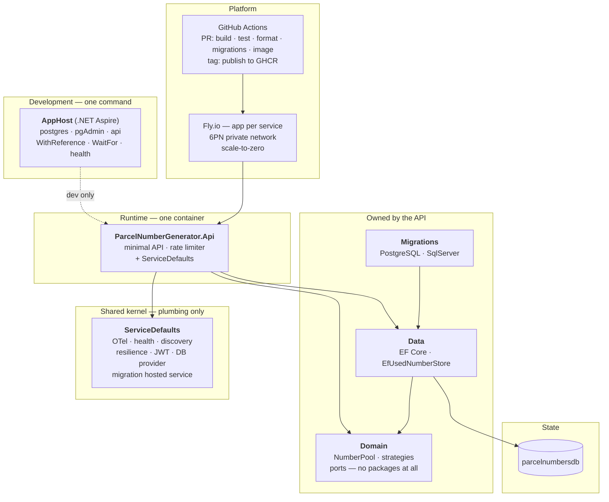

# 03 — Target architecture

> What the repository is now. Measured against
> [`architecture-standards/docs/architecture/00-REFERENCE-ARCHITECTURE.md`](https://github.com/konradcinkusz/architecture-standards/blob/master/docs/architecture/00-REFERENCE-ARCHITECTURE.md).

## 1. The shape



## 2. Projects

| Project | Holds | Depends on |
|---|---|---|
| `ParcelNumberGenerator.Domain` | `NumberRange`, `NumberPool`, the strategies, `ParcelNumberService`, the `IUsedNumberStore` and `IRandomSource` ports | **nothing** — no `PackageReference` at all |
| `ParcelNumberGenerator.Data` | `UsedNumber`, `ParcelNumbersDbContext`, `EfUsedNumberStore` | Domain, EF Core |
| `ParcelNumberGenerator.Migrations.{PostgreSQL,SqlServer}` | One migration set each | Data, its provider |
| `ParcelNumberGenerator.ServiceDefaults` | The kernel | framework + plumbing packages only |
| `ParcelNumberGenerator.Api` | Endpoints, DTOs, options, DI wiring, the startup guard, the Dockerfile | all of the above |
| `ParcelNumberGenerator.AppHost` | The dev composition root | Api, Aspire |
| `ParcelNumberGenerator.Tests` | 72 tests | all of the above |

The domain having no package reference at all is the load-bearing constraint: it is what
keeps the pool arithmetic — the part that was wrong before, in three separate ways — testable
without a database, a host or a configuration provider.

## 3. The allocation model

**A pool is a range minus exclusions**, normalized once at construction into disjoint
ascending segments with a prefix sum of their sizes. That buys two O(log segments) operations
with no I/O:

- `NumberAt(index)` — the i-th allocatable number, exclusions already skipped
- `IndexOf(number)` — the inverse, or `null` if the number is not allocatable

Exclusions therefore cost nothing at allocation time, and no strategy contains a special case
for them. The old code special-cased the excluded window inside its binary search, and did it
wrong.

**A strategy draws one number and claims it.** Three implementations of
`IAllocationStrategy`, selected by `Allocation:Strategy`:

| Name | How it works | When it is right |
|---|---|---|
| `random-probe` | Uniform random index, claim it, retry on collision | Sparse pools. One round trip; expected attempts `1 / (1 - density)` |
| `sequential-scan` | Stream the issued numbers in order, count gaps, take the k-th free one | Nearly-full pools. One pass, always finishes |
| `adaptive` *(default)* | Probe, and escalate to a scan on contention | Both. Free on the happy path |

`adaptive` is what makes the service correct at the edge rather than merely fast in the
middle. Neither of the other two covers a pool's whole life: probing cannot finish a nearly
full pool — drawing the last of 50 numbers uniformly takes about 50 attempts, so any fixed
budget gives up short of the end and the pool can never be drained — and scanning is wasteful
for the 99% of a pool's life when it is not nearly full. The escalation is triggered by the
outcome, not by a density measurement, because `Contended` already means "free numbers exist
but probing did not find one". Measuring density up front would add a `COUNT` to every
allocation, including the overwhelming majority that succeed on the first probe.

**Adding a fourth is one class and one line** in `ServiceCollectionExtensions`. No base class,
no framework to satisfy (P10).

## 4. Concurrency

The number is the primary key of `used_numbers`, and `TryReserveAsync` inserts and catches:

```
two callers draw 4,260,013
  ├── both reach INSERT
  ├── the database rejects one
  └── the loser gets `false`, and draws again
```

There is no window between a check and a write for two callers to interleave in, because
there is no check. The uniqueness is enforced by the database on every writer, including one
that bypasses this application entirely.

The catch is deliberately broad — the three supported providers report a duplicate three
different ways — and is made safe by re-reading: if the row is not there afterwards, the
original exception is rethrown rather than being reported as a lost race.

## 5. HTTP surface

| | | |
|---|---|---|
| `POST` | `/parcel-numbers?count=n` | Issues up to *n* numbers. Rate limited |
| `GET` | `/parcel-numbers/{number}` | Whether a number is issued, and whether it is allocatable at all |
| `GET` | `/pool` | Range, exclusions, capacity, used, remaining, density, active strategy |
| `GET` | `/health` | Readiness — every check |
| `GET` | `/alive` | Liveness — `live`-tagged checks only |

Status codes carry the distinction the caller acts on:

- **201** — at least one number was issued. A partial batch is still a 201, with
  `complete: false` and a reason, because those numbers are permanently claimed and reporting
  them as an error would burn them silently.
- **409** — the pool is exhausted. Retrying will never help.
- **503**, with `Retry-After` — contention. Retrying will help.
- **429** — the rate limiter. Allocation permanently consumes a finite resource, so an
  unthrottled caller in a loop does not merely load the service, it drains the pool.

## 6. Configuration

| Key | Default | Notes |
|---|---|---|
| `Pool:From` / `Pool:To` | `1` / `9999999` | Inclusive |
| `Pool:Exclusions:n:From` / `:To` | none | Any number of entries; overlaps merged |
| `Allocation:Strategy` | `adaptive` | Unknown values fail at startup, listing the valid ones |
| `Allocation:MaxAttempts` | `0` (strategy default) | |
| `Allocation:MaxBatchSize` | `1000` | Ceiling on `count` |
| `DATABASE_PROVIDER` | `PostgreSQL` | `SqlServer`, or in-memory with no connection string |
| `ConnectionStrings:parcelnumbersdb` | none | `fly secrets set` in cloud, user-secrets locally |
| `Jwt:Authority` | none | Absent ⇒ endpoints are open; see §7 |
| `Security:AllowAnonymousAccess` | `false` | Required to run an open deployment in Production |

Environment transport uses `__` as the separator: `ConnectionStrings__parcelnumbersdb`.

**One source of truth per variable.** The AppHost is authoritative for development —
`DATABASE_PROVIDER` and the connection string come from it. `flyio/*.fly.toml` is
authoritative for production non-secrets; `fly secrets` for production secrets. The
`appsettings.json` values are defaults for a clone with neither.

## 7. Security posture

This service **validates** tokens and holds no key material — it cannot mint one. Validation
is against an issuer's JWKS endpoint via OIDC discovery, so key rotation needs no deploy
here. P5's rule is structural rather than a matter of discipline: with a shared symmetric
secret, "can verify" and "can forge" are the same capability.

Registration is conditional on `Jwt:Authority` being present (P8), so a fresh clone runs with
no identity provider. The **startup guard** decides where that fallback is allowed: in
Production, the host refuses to start without both a connection string and an issuer, and the
error names the configuration key to set. Running an open production deployment is possible —
`Security:AllowAnonymousAccess=true` — and deliberately verbose, so it looks like a decision
in a diff. CI asserts the guard still fires by running the built image.

The in-memory fallback is guarded for the same reason: in production it would lose every
issued number on restart and then reissue them, and no health check would show it.

## 8. Deployment

Two Fly apps. The API has an `http_service` on `:8080`, scales to zero, and health-checks
`/health` with a 60-second grace period that covers a .NET cold start plus schema
work — migrations run after Kestrel starts, so probes answer while they are in flight.

Postgres has no `[http_service]` and no `[[services]]` block at all: it is reachable only over
Fly's private 6PN network. Its volume mounts with `PGDATA` in a subdirectory, because initdb
refuses a directory that is not empty and a volume root always carries `lost+found`.

`min_machines_running = 0` on the API is a live decision, not a default: nothing calls this
service inside another service's request path today. The day something does, either that
number becomes 1 or the caller's timeout has to cover a cold boot.

## 9. What this deliberately does not do

- **No event bus.** Nothing publishes an allocation. Adding one would be a recorded decision.
- **No number format.** The service issues integers. Check digits, carrier prefixes and
  barcode encodings belong to the caller — they are presentation over this number, and baking
  one in would make the pool arithmetic carrier-specific.
- **No reservation-without-commit.** There is no "hold this number for 10 minutes" flow,
  because no caller has needed one. It would be a second state on the entity, not a redesign.
- **No UI.** The WinForms application was removed rather than ported; see
  [`05-DECISIONS.md`](05-DECISIONS.md) D-3.
